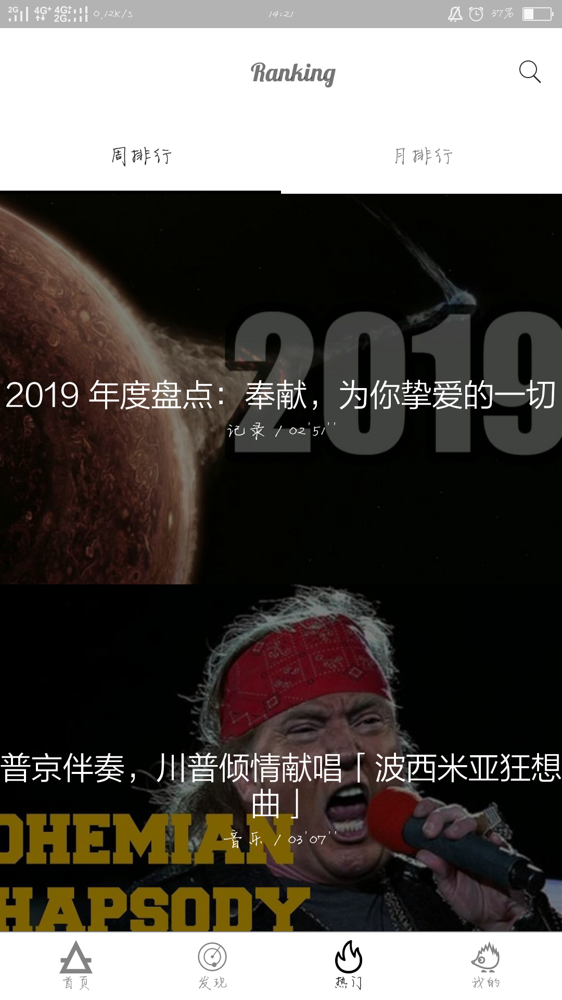
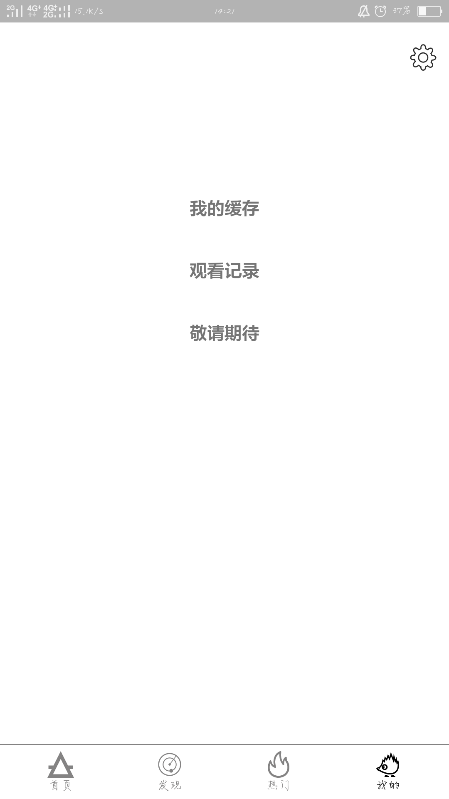

## 项目简介
   项目实现一款在线小视频观看APP，视频来源于Eyepetizer。

___

## 项目功能

- [x] “主页” 界面实现每日视频推荐功能，提供一系列推荐视频
- [x] “发现”界面提供视频类别的视频推荐
- [x] “热门”界面提供根据排行（周排行、列排行）排列的视频
- [x] 提供关键词搜索功能
- [x] 视频播放功能
- [x] 观看记录查询
- [ ] 视频缓存功能(出现bug)
- [ ] “发现”界面点击类别显示更多信息

___


## 项目开发

### 开源库使用

 - Retrofit：网络请求
 - RxJava：异步操作
 - Glide : 视频封面图片加载
 - Gson ：Json数据解析
 - RxDownload：视频缓存下载
 - Anko Commons：Intent、log的使用
 - GSYVideoPlayer：视频播放器
 - ...

### 项目框架

1. 使用GoogleMVP架构：Model+View+Presenter+Contract
2. view界面使用RecycleView展示较多，采用Adapter+Fragment的方式绑定数据并展示。
3. 项目经老师建议后采用lint扫描，改正了一些不规范之处。

___


## 项目截图






___

## 声明

**项目中的 API 均来自开眼视频，纯属学习交流使用，不得用于商业用途**

___

## License

``` javascript

Licensed under the Apache License, Version 2.0 (the "License");
you may not use this file except in compliance with the License.
You may obtain a copy of the License at

    http://www.apache.org/licenses/LICENSE-2.0

Unless required by applicable law or agreed to in writing, software
distributed under the License is distributed on an "AS IS" BASIS,
WITHOUT WARRANTIES OR CONDITIONS OF ANY KIND, either express or implied.
See the License for the specific language governing permissions and
limitations under the License.
```

